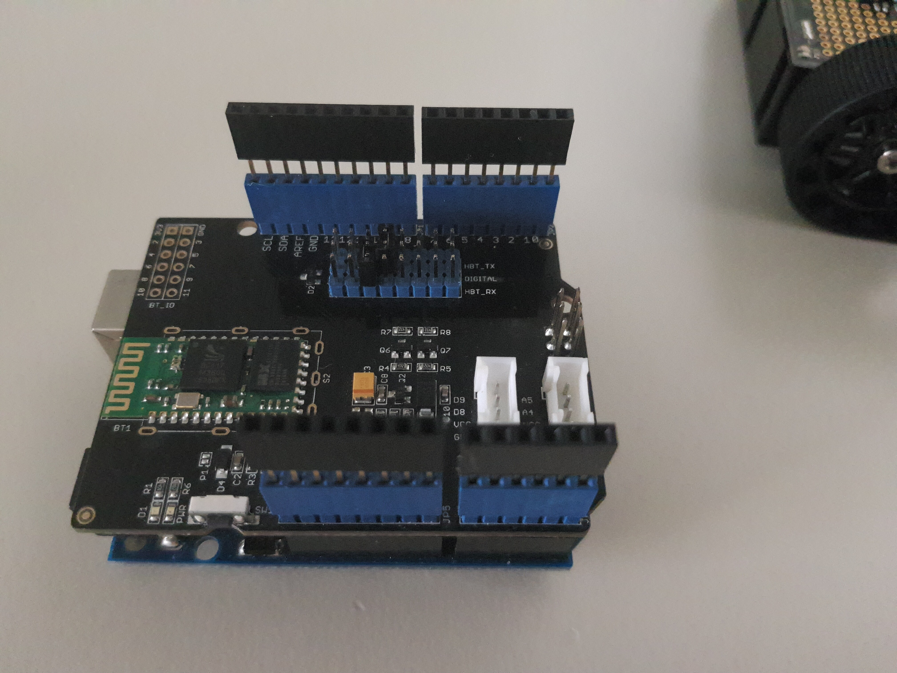

# ZumoShield

- [ZumoShield](#zumoshield)
  - [Ziel](#ziel)
  - [Merkmale](#merkmale)
    - [Fahren](#fahren)
    - [Musik spielen](#musik-spielen)
  - [Code Auszüge](#code-auszüge)
  - [Gelöste Probleme](#gelöste-probleme)
    - [Async Music](#async-music)
    - [Buzzer & Bluetooth Pins haben sich berührt](#buzzer--bluetooth-pins-haben-sich-berührt)
    - [Doppelbelegung der Pins durch Zumo und Bluetoothshield](#doppelbelegung-der-pins-durch-zumo-und-bluetoothshield)
  - [Nicht gelöste Probleme](#nicht-gelöste-probleme)
    - [Eigenschaften der Bluetooth verbindung](#eigenschaften-der-bluetooth-verbindung)
  - [Mögliche weitere Features](#mögliche-weitere-features)
    - [Selbst fahren](#selbst-fahren)
    - [Kurvenradius verstellen](#kurvenradius-verstellen)
    - [Geschwindigkeit via Slider ändern](#geschwindigkeit-via-slider-ändern)

## Ziel

Unser Ziel war, ein kleiner [Sumoroboter](https://www.pololu.com/product/2508), über eine Handy-App zu steuern.

## Merkmale

Muster:

- {Merkmal} : {Button}

### Fahren

- Richtung
  - Vorne : `w`
  - Hinten : `s`
  - Rechts vorne : `d`
  - Links vorne : `a`
  - Rechts hinten : `x`
  - Links hinten : `z`

- Fahrverhalten
  - Stoppen : `q`
  - Schneller : `r`
  - Langsamer : `f`

### Musik spielen

Es können mehrere Lieder von [hier](https://github.com/robsoncouto/arduino-songs) über den Buzzer gespielt werden.

- Musik spielen : `m`
- Musick pausieren : `p`
- Lied überspriengen : `n`

## Code Auszüge

Fahren:

- Gerade

```c
    if (recvChar == 'w')
    {
        speedL = defSpeed;
        speedR = defSpeed;
        drive();
    }
```

 Wenn man an den Roboter einen "w" schickt, werden die Geschwindigkeiten, auf beide Seiten (Links und Rechts), auf `defSpeed` (default speed) gesetzt. Dann wird die Funktion

```c
    void drive()
    {
      motors.setLeftSpeed(speedL);
      motors.setRightSpeed(speedR);
      delay(2);
    }
```

aufgerufen. Diese sorgt dafür, dass der Roboter dann auch fährt.

- Rückwärts

```c
    if (recvChar == 's')
    {
        speedL = -defSpeed;
        speedR = -defSpeed;
        drive();
    }
```

Bei der Rückwärtsfahrt wird die standard Geschwindigkeit negiert.

- Kurven

```c
    if (recvChar == 'd'){
        speedR = defSpeed / 2 ;
        speedL = defSpeed;
        drive();
    }
```

Wenn der Roboter sich drehen muss, wird eine der Geschwindigkeiten (in dieselbe Richtung wie er fahren will) halbiert.
Bei der Rückfahrt, wird diese Funktion negiert.

Musik spielen:

```c
    if (recvChar == 'm' && !musicPlaying){
        playSong();
    }
```

Es wird zuerst geprüft ob Musik schon spielt. Ohne diese Prüfung würde ein neues Lied anfangen zu spielen und das letzte pausiert. `playSong()` spielt das nächste Lied in der Reihe.

```c
    void songName()
    {
        int tempo = ...;

        int melody[] = {...};

        int notes = sizeof(melody) / sizeof(melody[0]) / 2;

        playMusic(melody, tempo, notes);
    }
```

`songName` ist der Name vom Lied. `tempo` ist die Geschwindigkeit `melody` ein Array mit allen Noten und `notes` die Anzahl der Noten.

```c
    void playMusic(int tempo, int melody[], int notes)
    {
        ...
        int lastNote = millis();

        for (int thisNote = 0; thisNote < notes * 2; 0)
        {
            ...
            unsigned int currentTime = millis();

            if (blueToothSerial.available())
            {
                char letter = blueToothSerial.read();
                if (letter == 'p')
                {
                    noTone(buzzer);
                    break;
                }
                ...
           }
        ...
        if (noteDuration + lastNote < currentTime)
        {
            noTone(buzzer);
            lastNote = currentTime;
            thisNote += 2;
        }
    }
```

Diese Funktion spiel dann das übergebene Lied. Mithilfe von `millis()` und
zwei Variablen (`lastNote` & `currentTime`) wird geprüft ob seit der letzten Note genug Zeit vergangen ist und die Nächste spielen kann.

Bluetooth Connection:

```c
    void setupBlueToothConnection()
    {
        blueToothSerial.begin(9600);
        blueToothSerial.print("AT");
        delay(400);
        blueToothSerial.print("AT+DEFAULT"); // Restore all setup value to factory setup
        delay(2000);
        blueToothSerial.print("AT+NAMESeeedBT"); // set the bluetooth name as "SeeedBT" ,the length of bluetooth name must less than 12 characters.
        delay(400);
        blueToothSerial.print("AT+PIN0000"); // set the pair code to connect
        delay(400);
        blueToothSerial.print("AT+AUTH1");
        delay(400);
        blueToothSerial.flush();
    }
```
Es wird hier eine Verbindung gestartet und die eigenen Eigenschaften erst auf Standardwerte der Bibliothek gesetzt. Dann mit passenderen überschrieben. Leider werden sie nicht immer zuverlässig überschrieben.

## Gelöste Probleme

### Async Music

Das zweit Größte Problem war, dass man während das Musikspielen, keine anderen Aktionen ausfuhren konnte.

Leider gibt es bei ein Mikrocontroller keine Möglichkeit, mehrere Threads zu erstellen oder Code async laufen zu lassen.

Um das Problem umzugehen, haben wir anstatt einen `delay()` eine if Abfrage erstellt, die bei jeden Durchlauf prüft, ob die Benötigte Zeit schon vergangen ist.

```c
    if (noteDuration + lastNote < currentTime){
        ...
        lastNote = currentTime;
        ...
    }
```

### Buzzer & Bluetooth Pins haben sich berührt

Bei jedem Einschalten des Boards, hat man festgestellt, dass der Buzzer kurz angeht.

Grund war, eine Berührung zwischen den Pins am Bluetoothboard & die Pins des Buzzers.

Das Problem wurde gelöst, indem man noch eine Reihe an Abständen installiert hat, die den ganzen Bluetoothmodul höhergestellt hat.



### Doppelbelegung der Pins durch Zumo und Bluetoothshield

Die standard Pins des Bluetooth Moduls für Kommunikation überschneideten sich mit denen des Zumos, die Kommunikation wurde gestört sobald die Motoren eingeschaltet wurden. Konnte einfach gelöst werden, da das Bluetoothshield es ermöglichte, die Pins einfach per Jumper zu verändern.

## Nicht gelöste Probleme

### Eigenschaften der Bluetooth verbindung

Die bluetooth Einstellungen werden manchmal korrekt übernommen und der Arduino ist als `SeeedBT` erreichbar manchmal aber als `HMSoft`. Des Weiteren wird auch das Passwort nicht richtig gesetzt.

## Mögliche weitere Features

### Selbst fahren

Der Roboter hat auf der unteren Seite eine Reihe an Lichtsensorn, die man nutzen könnte, um weiße/schwarze Linien zu folgen.

### Kurvenradius verstellen

Wie bereits schon erklärt, wird zurzeit bei Kurven die Geschwindigkeit auf eine Seite halbiert. Falls man aber scharfe Kurven fahren will, muss man zum Beispiel zwischen Linksvorne und Rechtshinten alternieren. Wenn man die Zahl durch der man teilt verändern könnte, wären steilere sowie schärfere Kurven möglich.

### Geschwindigkeit via Slider ändern

Wenn die Geschwindigkeit geändert werden soll muss man in vordefinierten Schriten verändern, dies ist jedoch für Prezision schlecht.
